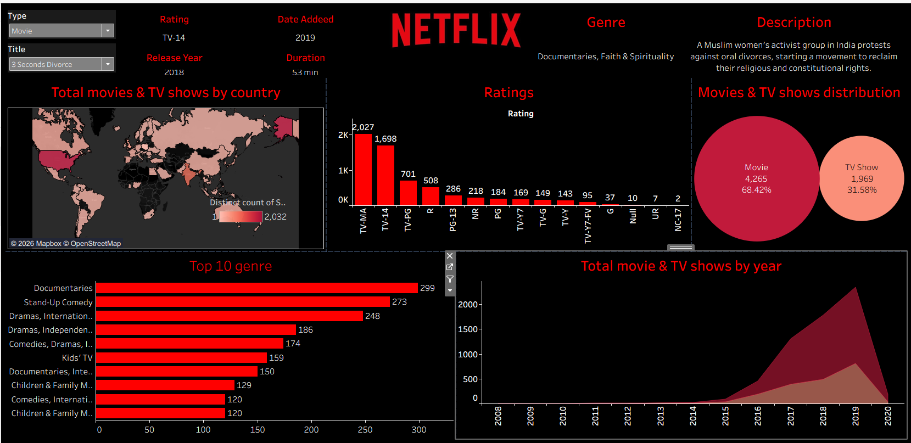

# 📺 Netflix Movies & TV Shows Dashboard (Tableau)

An interactive **Tableau dashboard** analyzing Netflix Movies and TV Shows based on genre, ratings, country distribution, and yearly trends.

---

## 📊 Dashboard Overview

This dashboard provides insights into:

- 🌍 Total Movies & TV Shows by Country  
- 🎭 Top 10 Genres  
- ⭐ Ratings Distribution  
- 🎬 Movies vs TV Shows split  
- 📈 Content added over the years  
- 📝 Dynamic show/movie description panel  

---

## 🛠 Tools Used

- **Tableau**
- **Netflix Dataset (CSV)**
- **Mapbox (for map visualization)**

---

## 📁 Repository Contents

| File | Description |
|------|-------------|
| `Netflix_Dashboard.twbx` | Tableau packaged workbook |
| `netflix_titles.csv` | Dataset used for analysis |
| `netflix-dashboard.png` | Preview of the dashboard |

---

## 📌 Key Insights

- 🎬 Movies make up the majority of Netflix content  
- 🌎 USA and India are top content-producing countries  
- 🎭 Documentaries & Dramas are the most popular genres  
- ⭐ TV-MA and TV-14 are the most common ratings  
- 📈 Huge growth in content additions after 2016  

---

## 🎯 Dashboard Features

✔ Interactive filters (Type, Title, Genre)  
✔ Country-wise content map  
✔ Year-wise trend analysis  
✔ Genre ranking chart  
✔ Dynamic movie/TV show details  

---

## 🚀 How to View

### Open in Tableau
Download the `.twbx` file and open in:
- Tableau Public  
- Tableau Desktop  

## 📸 Dashboard Preview

---
